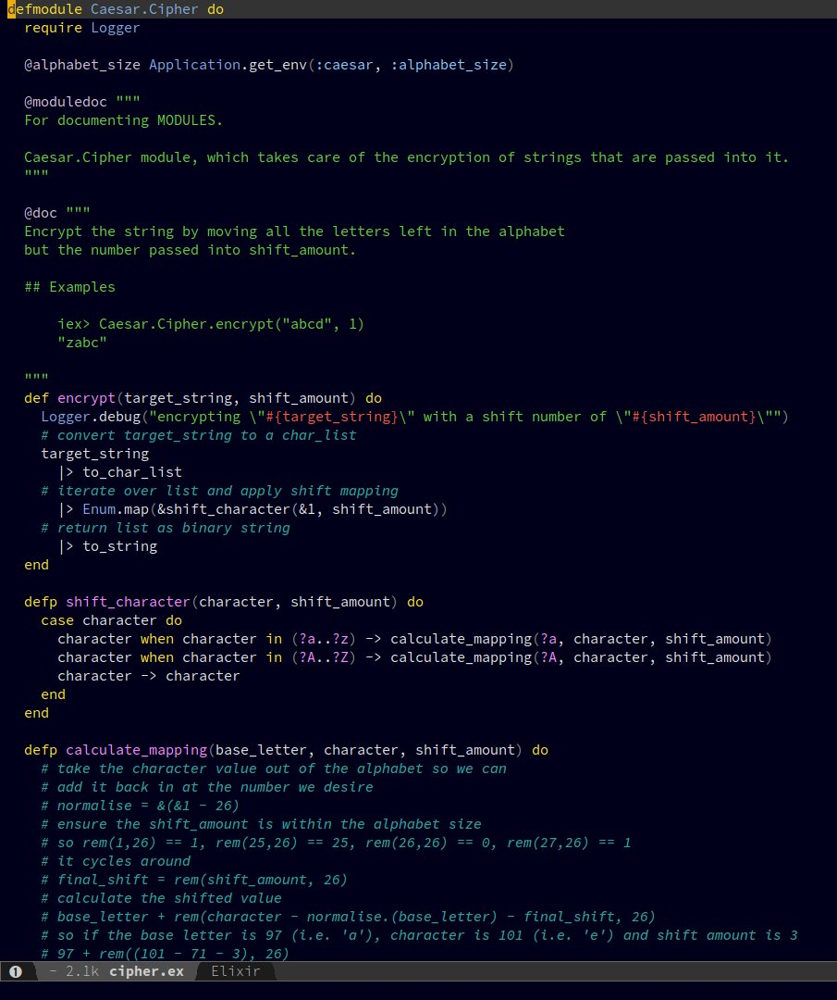

# darkane-theme
A dark Emacs theme based closely on [Andre Richter's Lush theme](https://github.com/andre-richter/emacs-lush-theme) for Emacs24+

## Installation

Add darkane-theme.el into somewhere in your loadpath `~/.emacs.d/`

You can apply the theme via <kbd>M-x customize-themes</kbd> or make it your default theme by adding the following to your Emacs configuration file:

```el
(load-theme 'darkane t)
```

## Screenshots

### Elixir


## Credits

* [Andre Richter's Lush theme](https://github.com/andre-richter/emacs-lush-theme)
